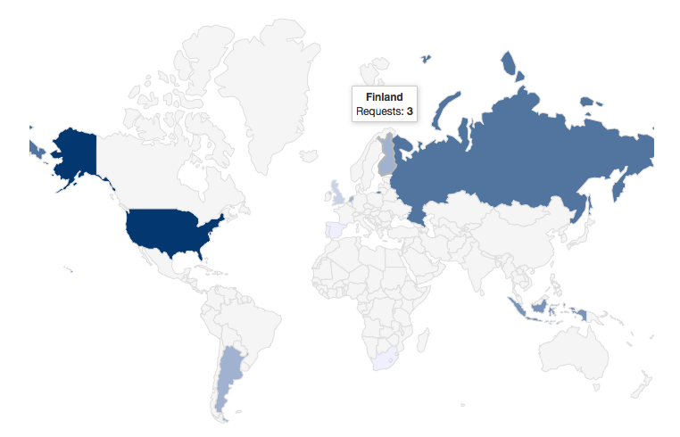
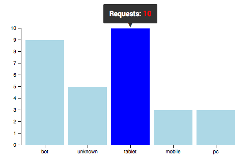
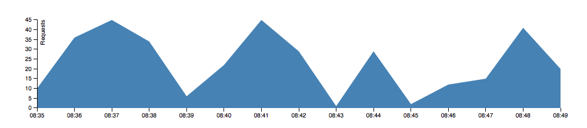
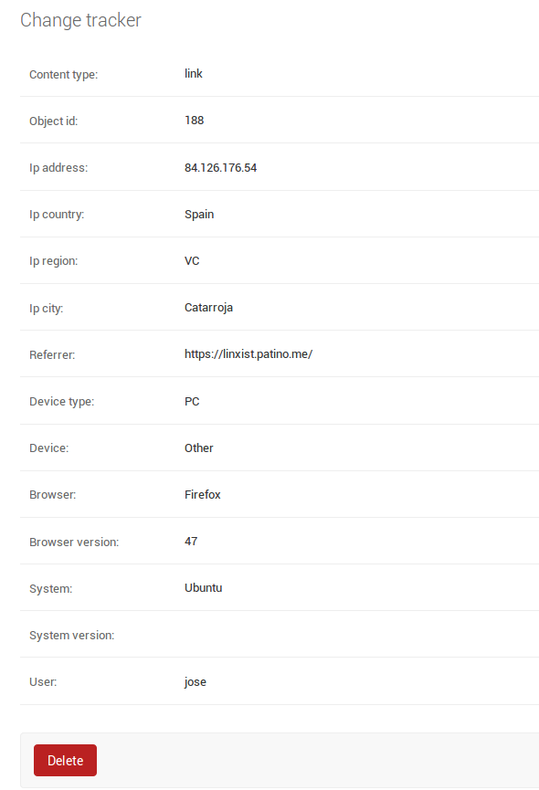

.. _usage:

=====
Usage
=====

Overview
========

Django Tracking Analyzer is a Django application that aims to help you know in
a simple and user-friendly way who the visitors of your site are, where they
come from, what devices are they using to browse your site, what resources of
your site they access, when and how many times.

In order to do this, DTA implements a database model ``Tracker``, which will be
created each time a user access certain resource, like a blog post, or performs
certain action, like buying a product in your web shop.

Then, using the Django admin interface, you can check the "Trackers" changelist
in the "Django Tracking Analyzer" app admin, and you will see a changelist of
all the user accesses with details about the requests, like the IP address, the
country and city (if available), the device type, browser and system information.

And also, heading the traditional changelist page, you will be provided with some
nice interactive graphics made in D3.js, to actually see all the data gathered
in a visual fancy way:

- A world map where you can see where the visitors of your site come from.

- A bars graph showing the number of requests per device type.

- A timeline showing the number of requests for the current changelist page.

Tracking requests or events
===========================

Collecting users data is as simple as relate a user request with a Django model
that represents something you want to track: a blog post, an item in a webshop
or anything else you have represented as a database model in your Django site.

The ``Tracker`` model then will relate a request with such an object of your
choice, collecting all the relevant request data like geolocation, user device,
browser and system version. When you have several ``Tracker``'s collected, you
can visualize the data and get an idea of what kind of users you site have or
who is buying what products in your webshop.

A ``Tracker`` object can be created by using the special manager method
``create_from_request``:

.. code-block:: python

   Tracker.objects.create_from_request(request, model_instance)

As you can see, the only things needed are an HTTP request object and a model
instance. This makes it very easy to record tracks in any view of your project,
which will be the place where a user interacts with some resource or performs
some action: the Django views.

You can override the ``get_object`` method in a ``DetailView``, if you are
usign class-based views, or you can create the ``Tracker`` wherever you want in
your function views. The only thing you need is a ``django.http.HttpRequest``
instance, which is of course available in any Django view, and a database model
instance you want to track.

Examples
--------

Let's see an example of how to track a user action. Imagine you have a web shop
and you want to get a track of the users who buy products from it.

You could have a view in your code that, once a user submits a purchasing form,
executes some code to perform the purchase/payment operations. In such a view,
you can simply add the ``Tracker`` object creation after the purchase is
completed, making a system record of the client.

.. code-block:: python

   from django.contrib.auth.decorators import login_required
   from django.shortcuts import get_object_or_404, render_to_response

   from tracking_analyzer.models import Tracker

   @login_required
   def purchase_item(request, product_pk):
       product = get_object_or_404(Product, pk=product_pk)

       # Here is your logic to perform the purchase...
       ...
       # ...and to make the payment and other needed operations.

       # Track the products purchases!
       Tracker.objects.create_from_request(self.request, product)

       return render_to_response(template, context_dict, RequestContext(request))

With that simple line added to your code, you'll have a detail log of every 
purchase request. Note that the special manager method ``create_from_request``
does everything for you in terms of collecting request information and relating
it to the passed object instance.

In other environment, you might be using Django class-based views. Let's see an
example in which you have a news site, so you have daily news posted in a main
page and the users can read each notice by clicking the title. Then you might
have a ``DetailView`` to show a notice by its slug, and so you can track the
visitors to your news by using DTA in a similar way than before:

.. code-block:: python

   from django.views.generic import DetailView

   from tracking_analyzer.models import Tracker

   from news.models import NewsEntry

   class NewsEntry(DetailView):
       model = NewsEntry

       def get_object(self, queryset=None):
           # Retrieve the news entry just using `get_object` functionality.
           entry = super(PostDetailView, self).get_object(queryset)

           # Track the users access to the news by entry!
           Tracker.objects.create_from_request(self.request, entry)

           return entry

As you can see, it's pretty simple and straightforward to start collecting
user data from the requests to your site.

If you go to your Django admin, "Django Tracking Analyzer" - "Trackers" section,
you will see a regular Django changelist of "trackers". Then if you click the
"Details" link in one of them, you can see the request data overview as follows:

